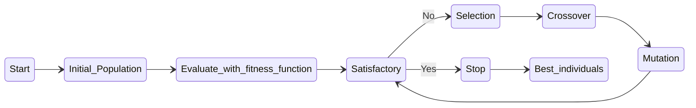
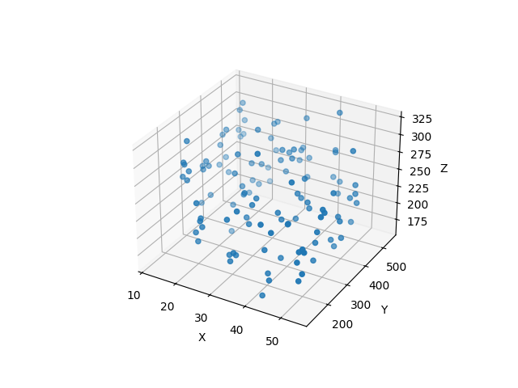
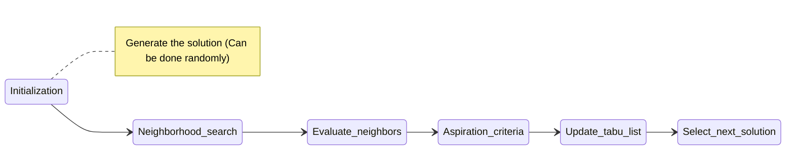

**Travelling Salesman Problem**

- Genetický algoritmus
- Tabu search

## Zadanie úlohy _(c 1,2) Problém obchodného cestujúceho (Travelling Salesman Problem)_

Našou úlohou bolo vyriešiť problém nájdenia najkratšej cesty medzi N mestami.

Muselo sa postupovať dvoma algoritmami:

- Genetický algoritmus
- Zakázané prehľadávanie (tabu search)

## Implementačné prostredie

Program je vytvorenej v `Python 3.10.11` a na správne fungovanie sa využíva knižnica `random` a `sys`
a `matplotlib.pyplot`.

## Priebeh programu

Program sa spustí pomocou operátora „-a“ na výber algoritmu:

```cmd
use:
   python main.py <algorithm> [options]
algorithm:
  -a [g = genetic, t = tabu-search]
options:
  -n [int(default=11)]
```

Program bude vypisovať aktuálni hodnoty, ako:

- Aktuálna hodnota (najlepšia (najmenšia) cesta)
- Hĺbka
- Počet vytvorených génov

A graficky zobraziť aktuálny stav:


A po ukončeniu aj poradie:

```cmd
>Best: 874.95010054318 | Depth: 48 | Gen Gen: 62476011
>Order: [44, 29, 47, 9, 42, 50, 11, 25, 16, 39, 12, 0, 30, 17, 43, 2, 4, 31, 26, 22, 8, 35, 28, 1, 23, 27, 21, 32, 14, 19, 40, 38, 37, 20, 7, 49, 46, 5, 24, 34, 45, 3, 33, 15, 48, 13, 36, 18, 41, 6, 10]
```

## Algoritmy

### Genetický algoritmus

> Je heuristický algoritmus inšpirovaný prirodzeným procesom evolúcie. _Evolúcia opisuje zmenu biologických vlastností
druhov v priebehu generácií prostredníctvom prirodzeného výberu._

**Výhody**:

- Globálna optimalizácia:
    - GA sú schopné nájsť riešenia v komplexných prehľadávacích priestoroch, vďaka čomu sú vhodné pre problémy, kde je
      priestor riešení málo prehľadný alebo veľmi nelineárny.
- Paralelné spracovanie:
    - GA prirodzene pracujú s populáciou riešení, ktoré sa môžu vyhodnocovať paralelne. To umožňuje efektívne využívať
      zdroje na paralelné spracovanie.
- Robustnosť:
    - GA sú často robustné v hlučnom prostredí alebo pri nedokonalých hodnoteniach vhodnosti. Je menej pravdepodobné, že
      sa zaseknú v lokálnom optime.

**Nevýhody**:

- Výpočtová náročnosť:
    - GA môžu byť výpočtovo náročné, najmä v prípade veľkých problémových priestorov alebo pri použití zložitých fitness
      funkcií.
- Ladenie parametrov:
    - GA často vyžadujú starostlivé ladenie parametrov, ako je veľkosť populácie, rýchlosť mutácie, rýchlosť kríženia a
      výberové mechanizmy. Nájsť správny súbor parametrov môže byť netriviálna úloha.
- Žiadna záruka globálneho optima:
    - Neexistuje žiadna záruka, že genetický algoritmus nájde globálne optimum, aj keď je navrhnutý na globálnu
      optimalizáciu. Je možné, že GA bude konvergovať k suboptimálnemu riešeniu.

#### Algorithm



#### Fitness function

Funkcia, ktorá vyhodnocuje kvalitu riešení.

```python
def calcHeuristicValue(state):
    heuristic = 0

    len_of_state = len(state)

    for index in range(len_of_state - 1):
        heuristic += distance(points[(state[index])], points[state[index + 1]])

    return heuristic
```

*Taka ista funkcia je použitá aj pre GA.

Podarilo sa mi tiež zobraziť riešenia s ich kvalitou v 3d grafike:



*X,Y - order of cities represented as x and y coordinate. Z - heuristic value.

#### Crossover

_(S najvhodnejšími jedincami)_ Generujte nových jedincov náhodným krížením ich "riešení" (génov).

**V mojom projekte ja používal som **Partially - Mapped Crossover (PMX) Goldberg and Lingle (1985)****

### Zakázané prehľadávanie (tabu search)

> Je heuristický _optimalizačný_ algoritmus používaný na riešenie zložitých kombinatorikách optimalizačných problémov.

Základnou myšlienkou je preskúmanie priestoru riešení presunom z jedného riešenia na susedné riešenie.

**Výhody**:

- Globálna optimalizácia:
    - Tabu Search je efektívne pri hľadaní vysokokvalitných riešení v zložitých nekonvexných priestoroch. Dokáže riešiť
      problémy s viacerými lokálnymi optimami.
- Odolnosť voči lokálnym optimám:
    - Tabu Search využíva stratégie, ako sú kritériá ašpirácie, ktoré umožňujú pohyby vedúce k lepším riešeniam, aj keď
      sa nachádzajú v tabu zozname. To pomáha vyhnúť sa uviaznutie v lokálnom optime.
- Zachovanie rozmanitosti:
    - Tabu Search prirodzene skúma širokú škálu riešení vďaka rovnováhe medzi prieskumom a využívaním, čo pomáha
      predchádzať predčasnej konvergencii k suboptimálnym riešeniam.

**Nevýhody**:

- Citlivosť na parametre:
    - Tabu Search často zahŕňa ladenie parametrov, ako je tabu tenure, kritériá ašpirácie a veľkosť okolia. Účinnosť
      algoritmu môže byť citlivá na výber týchto parametrov.
- Výpočtová náročnosť:
    - V závislosti od zložitosti problému a veľkosti priestoru riešení môže byť hľadanie Tabu náročné na výpočty. To
      môže byť nevýhodou pri rozsiahlych problémoch.
- Obmedzená pamäť:
    - Tabu zoznam v Tabu Search má konečnú kapacitu, čo znamená, že časom môže zabudnúť potenciálne cenné informácie. To
      môže brániť schopnosti algoritmu uniknúť z lokálneho optima.

## Algorithm



### Neighborhood/Neighbors search

Výber štruktúry okolia je špecifický pre daný problém a závisí od povahy optimalizačného problému, ktorý riešite.
Ktorý sa snažíte vyriešiť.

**Na nájdenie susedov som použil logiku preskupenia dvoch miest v riešení.**

## Zhodnotenie riešenia

### Možnosti rozšírenia

#### Genetický algoritmus

**Optimalizácia**:

- Parametre algoritmu:
    - Je obzvlášť dôležité vyladiť parametre, ako je veľkosť populácie, pravdepodobnosť kríženia, pravdepodobnosť
      mutácie atď. Optimalizácia týchto parametrov môže výrazne ovplyvniť výkonnosť algoritmu.

**Možnosti rozšírenia**:

- Elitizmus:
    - Implementujte mechanizmus elitizmu, ktorý umožňuje, aby najlepšie riešenia z predchádzajúcej populácie automaticky
      prešli do ďalšej generácie.
- Multikriteriálna optimalizácia:
    - Rozšírenie GA na riešenie multikriteriálnych problémov pomocou techník, ako je archív nedominovaných riešení (
      NSGA) alebo vážený súčet kritérií.
- Hybridizácia:
    - Zváženie hybridizácie GA s inými optimalizačnými metódami alebo heuristikami s cieľom zlepšiť výkonnosť v
      konkrétnych scenároch.

#### Zakázané prehľadávanie (tabu search)

**Optimalizácia**:

- Pomocou rôznych funkcií sa nájdu optimálne susediace riešeniayu.

**Možnosti rozšírenia**:

- Intenzifikácia a diverzifikácia:
    - Zvážte zavedenie stratégií intenzifikácie (zameranie sa na aktuálne najlepšie riešenie) a diverzifikácie (skúmanie
      nových oblastí riešenia).
- Adaptívne metódy:
    - Použite metódy adaptácie parametrov, ktoré umožňujú algoritmu dynamicky upravovať svoje parametre počas
      optimalizačného procesu.
- Multikriteriálna optimalizácia:
    - Zvážte prispôsobenie metódy vyhľadávania so zákazmi na riešenie multikriteriálnych problémov.

### Testovanie

| Num of cities | Genetic (heuristic/gen gen/secs) | Tabu-search  (heuristic/gen gen/secs) |
|---------------|----------------------------------|---------------------------------------|
| 11            | 268 / 1903 / 3.1416              | 275 / 3861 / 3.6284                   |
| 11            | 318 / 1063 / 4.1544              | 299 / 386 / 3.631                     |
| 11            | 298 / 1399 / 4.6842              | 270 / 3311 / 3.2925                   |
| 51            | 1395 / 58,191 / 11.0477          | 802 / 573,761 / 42.6795               |
| 51            | 1408 / 24,463 / 8.6952           | 777 / 6,375,166 / 46.4211             |
| 51            | 1338 / 19,023 / 9.6111           | 754 / 624,761 / 46.2733               |
| 101           | 3196.8808 / 2,013,871 / 24.0241  | 1894 / 5,213,415 / 142.23             |
| 101           | 3185.7780 / 145,221 / 25.0509    | 1609 / 3,787,511  / -                 |

Po analýze grafu môžeme povedať, že algoritmus „tabu-search“ je efektívnejší, ako „genetický“, pretože jeho riešenie je
lepšie. Na rozdiel od neho však využíva OVELA viac pamäte na uloženie tabuľky tabu a tiež prehľadáva (generuje) viac
génov.

> (Tabu-search) Python na hranenie 11 cisel od 1 do 11 potrebuje `28 B`(bytes). Tak potom na vyriešenie jednoduchej
> úlohy s 11 mestami
> je potrebných `108 KB` pamäte. A pre prvy moment z 101, kde on vygeneroval viac, ako 5 millionov: `145 MB`.

Ale nesmiem zabudnúť dodať, že moje nastavenia genetického algoritmu nemusia byť úplne efektívne.

